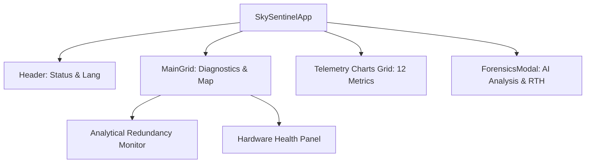

# Глава 4.2. Програмний комплекс SkySentinel: Інтерфейс та інтелектуальний аналіз відмов

### 1. Загальна архітектура та концепція Dashboard
Програмний комплекс наземної станції керування (GCS) «SkySentinel» реалізований як високонавантажений веб-додаток на базі фреймворку React. Інтерфейс побудований за парадигмою **«Glass Cockpit»**, що передбачає мінімізацію когнітивного навантаження на оператора шляхом акцентування уваги на критичних параметрах польоту.

Дизайн Dashboard виконаний у темній кольоровій гамі (Dark Theme), що забезпечує високу контрастність та читабельність даних у різних умовах освітлення. У верхній частині інтерфейсу розташована панель статусів (Header), яка включає:
*   **«Зв’язок»:** Індикатор активності WebSocket-з’єднання з бортовим сегментом.
*   **«Системний пульс»:** Лічильник часу аптайму системи, що підтверджує стабільність роботи CI/CD конвеєра та бекенд-серверів.
*   **Локалізація:** Модуль перемикання мов (UA/EN) для забезпечення інформаційної сумісності з міжнародними стандартами.

### 2. Монітор аналітичної надмірності (Analytical Redundancy Monitor)
Центральним елементом діагностики стану БПЛА є віджет «Analytical Redundancy», що безпосередньо впроваджує принципи, викладені у **Лекції №10**. 

Даний модуль виконує порівняльний аналіз даних з двох незалежних джерел:
1.  **Повітряна швидкість (Airspeed):** Отримується з датчика диференційного тиску (трубка Піто).
2.  **Шляхова швидкість (Ground Speed):** Розраховується за допомогою навігаційного GNSS-модуля.

Алгоритм обчислює нев’язку ($\Delta$) між аеродинамічними та навігаційними параметрами. Наприклад, при штатному польоті (84.9 км/год за Піто проти 82 км/год за GPS) дельта знаходиться в межах допуску. У разі критичного розходження система ідентифікує відмову датчика тиску (засмічення трубки Піто) або аномальний дрейф сенсорів, що є класичним прикладом реалізації логіки **Fault Detection** через аналітичну модель.

### 3. Модуль графічного аналізу (Telemetry Charts Grid)
Для візуалізації динаміки польоту та виявлення перехідних процесів реалізовано сітку з 12 інтерактивних графіків. Відповідно до **Лекції №10 (Слайд 4)**, цей модуль виконує дві критичні функції:
*   **Моніторинг «Перехідних процесів»:** Аналіз реакції БПЛА на керуючі впливи (наприклад, зміна кутів тангажу та крен при зміні тяги двигуна).
*   **Offline-аналіз польоту:** Можливість детального вивчення телеметрії після завершення місії для ідентифікації прихованих відмов обладнання.

Список параметрів включає: Altitude, Battery Level, Airspeed, Vertical Speed, Pitch, Roll, Throttle, Temperature, RSSI, Latency, Servo Current.

### 4. Журнал подій та інтелектуальна діагностика (Incident Forensics)
Система веде безперервний «Журнал подій», де фіксуються аномалії трьох типів: Critical, Warning, Advisory (**Лекція №4**). При виявленні серйозної відмови (наприклад, *Overheat* або *Stall*) оператор може активувати вікно інтелектуального аналізу «Incident Forensics».

Це вікно включає:
*   **Telemetry Snapshot:** Миттєвий зріз критичних параметрів (Pitch, Roll, Throttle, VSI) у момент виникнення відмови.
*   **AI Analysis Panel:** Використання LLM-моделей для **Root Cause Analysis** (Лекція №8-9). Наприклад, система може виявити логічний ланцюжок: *«Перегрів регулятора ходу $\rightarrow$ Падіння напруги $\rightarrow$ Втрата тяги»*.
*   **Failsafe Integration:** Кнопка «Execute Failsafe (RTH)», що замикає контур управління, дозволяючи оператору миттєво активувати алгоритм повернення на точку зльоту.

### 5. Стан обладнання (Hardware & Energy Level)
Окремий блок моніторингу присвячений «Енергетичній групі параметрів» (**Лекція №10**). Впроваджено візуалізацію:
*   **Battery %:** Запобігання повній втраті живлення.
*   **Temperature (°C):** Контроль теплової деградації електроніки.
*   **RSSI (dBm) та Latency (ms):** Моніторинг цілісності каналу зв’язку.

---

### Технічні таблиці та діаграми

**Таблиця 4.2.1. Взаємозв’язок віджетів інтерфейсу та діагностичної логіки**

| Назва віджета | Параметри моніторингу | Джерело (Лекція) | Діагностична логіка |
| :--- | :--- | :--- | :--- |
| Redundancy Monitor | Airspeed / GroundSpeed | Лекція №10 | Обчислення нев'язки (Residual) |
| Hardware Health | Battery, Temp, RSSI | Лекція №8-9 | Аналіз деградації енергії та зв'язку |
| Master Caution | Всі критичні аномалії | Лекція №4 | Контроль граничних значень |
| Telemetry Grid | 12 параметрів стану | Лекція №10 | Аналіз перехідних процесів |

**Ієрархія компонентів інтерфейсу:**

---

### Висновок по розділу
Програмний комплекс SkySentinel забезпечує повний цикл підтримки прийняття рішень оператором. Впровадження алгоритмів аналітичної надмірності та залучення методів штучного інтелекту для аналізу першопричин (Root Cause) дозволяє мінімізувати вплив людського фактору на безпеку польотів, що повністю відповідає вимогам до сучасних КІУС.
